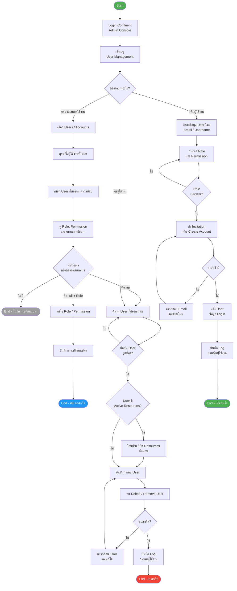

# Confluent User Management - Flowchart

ขั้นตอนการจัดการผู้ใช้งานใน Confluent: ตรวจสอบ, ลบ, และเพิ่มผู้ใช้งาน

## Flowchart

## ขั้นตอนสรุป

### 1. ตรวจสอบการใช้งาน (Check)
| ขั้นตอน | รายละเอียด |
|--------|-----------|
| 1 | Login Confluent Admin Console |
| 2 | ไปที่ User Management |
| 3 | ค้นหาและเลือก User |
| 4 | ตรวจสอบ Role, Permission และสถานะ |
| 5 | แก้ไขหากจำเป็น แล้วบันทึก |

### 2. ลบผู้ใช้งาน (Delete)
| ขั้นตอน | รายละเอียด |
|--------|-----------|
| 1 | ค้นหา User ที่ต้องการลบ |
| 2 | ตรวจสอบว่ามี Active Resources หรือไม่ |
| 3 | โอนย้าย/ปิด Resources (ถ้ามี) |
| 4 | ยืนยันและกด Delete |
| 5 | บันทึก Log การลบ |

### 3. เพิ่มผู้ใช้งาน (Add)
| ขั้นตอน | รายละเอียด |
|--------|-----------|
| 1 | กรอกข้อมูล User (Email/Username) |
| 2 | กำหนด Role และ Permission ที่เหมาะสม |
| 3 | ส่ง Invitation หรือสร้าง Account |
| 4 | แจ้ง Login credentials ให้ User |
| 5 | บันทึก Log การเพิ่มผู้ใช้งาน |

## หมายเหตุ
- ควร log ทุกการเปลี่ยนแปลงสิทธิ์เพื่อ audit trail
- การลบ User ควรได้รับการอนุมัติจาก Admin ก่อนเสมอ
- ตรวจสอบ Active Resources ก่อนลบเพื่อป้องกันข้อมูลสูญหาย
