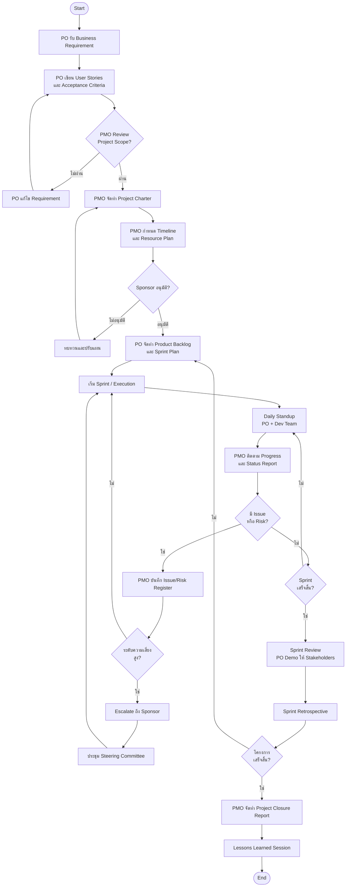

# PMO & PO Workflow

กระบวนการทำงานร่วมกันระหว่าง PMO และ PO (Product Owner)

## ภาพรวมกระบวนการ



## รายละเอียดบทบาท

### PMO มีหน้าที่
- จัดทำและดูแล Project Charter, Timeline, Budget
- ติดตาม Progress และจัดทำ Status Report
- บริหาร Risk และ Issue
- รายงานต่อ Steering Committee / Sponsor

### PO มีหน้าที่
- รับและวิเคราะห์ Business Requirement
- เขียนและจัดลำดับ Product Backlog
- กำหนด Acceptance Criteria
- Demo ผลลัพธ์ให้ Stakeholders

## จุดตัดสินใจหลัก (Decision Gates)

| จุด | ผู้ตัดสินใจ | เกณฑ์ |
|-----|-----------|-------|
| PMO Review Scope | PMO Lead | ขอบเขตชัดเจน, วัดผลได้ |
| Sponsor Approval | Sponsor | Budget และ Timeline อนุมัติ |
| Risk Escalation | PMO + Sponsor | Risk Level = สูง หรือ สูงมาก |
| Project Closure | Sponsor + PMO | Deliverables ส่งมอบครบ |
```
